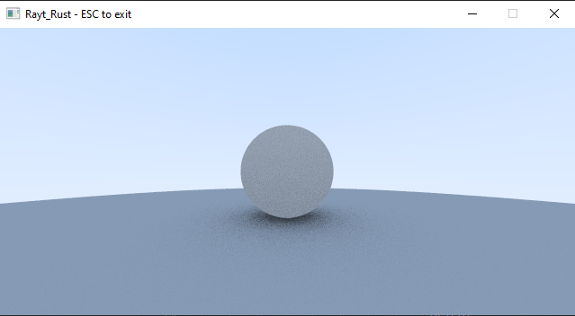

# rayt_rust_project
Copyright (c) 2019 Kegan Bako-Listy

In this project I am working on implementing a simple ray tracer rendering program in Rust. I am going to be using the book "Ray Tracing in One Weekend", by Peter Shirley to guide me in this endeavor. The ray tracer in the book is written in c++ so I will be rewriting the code in Rust. I did not finish all of the content in the book, but what is implemented is the basics of a ray tracing renderer. 

To run my project just type “cargo run” after downloading the files. A small window will pop up called “Rayt_Rust - ESC to exit”. It takes about 15 seconds for the image to render on my computer so expect the window to be blank for that much time or longer. Eventually an image like this should appear: 

